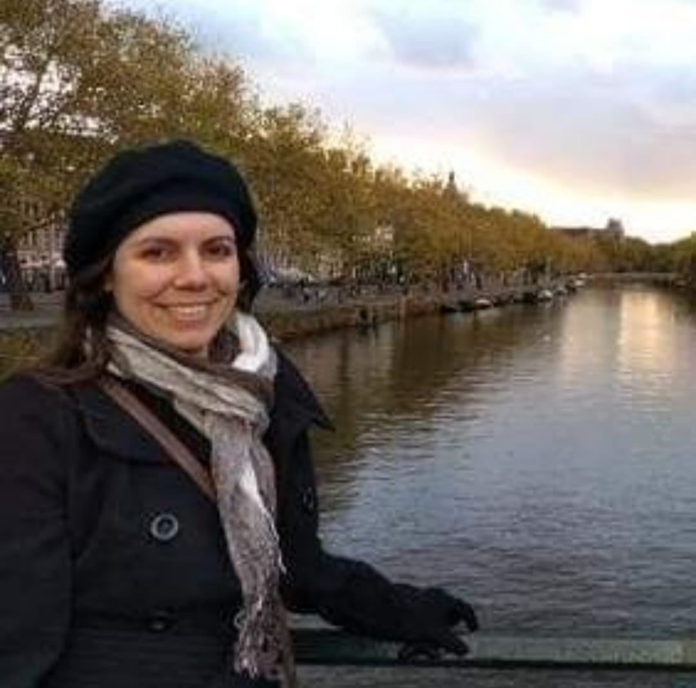

# FATEC Prof. Jessen Vidal - São José dos Campos - 1º Semestre DSM
Projeto desenvolvido para a API (Aprendizagem por Projeto Integrado) do 1° semestre de Desenvolvimento de Software Multiplataforma (DSM) que consiste em um site que reune informações sobre a Insuficiência Renal Crônica em crianças para o acesso pelos seus cuidadores.

<br>

### ⌛ Status do projeto: 2/4 Sprint

<br>

## 📑 Sumário
- [Sobre o projeto](#sobre-o-projeto)
- [Tecnologias usadas](#tecnologias)
- [MVP](#mvp)
- [Sobre o projeto](#sobre-o-projeto)
- [Product backlog](#product-backlog)
- [Autores](#autores)

<br>
<br>

## 📢 Sobre o Projeto <a name="sobre-o-projeto"></a>

Nosso projeto consiste em um site que reune dados e informações sobre a Insuficiência Renal Crônica Pediátrica. Esse projeto é destinado aos pais e cuidadores de crianças que possuem essa doença, para que possa auxiliá-los com informações úteis e atualizadas.

<br>

## 🛠 Tecnologias usadas até o momento <a name="tecnologias"></a>
- [Figma](http://www.figma.com): Execução do protótipo do wireframe
- [GitHub](https://github.com): Versionamento e documentação do projeto
- [Slack](https://slack.com/intl/pt-br): Contato com o cliente
- [Planner](https://tasks.office.com/): Organização das tarefas do grupo
- HTML
- CSS

<br>

## 💻 MVP<a name="mvp"></a>
### 🔴 <a href="https://www.figma.com/proto/2V0EagZNOnDKmTYD8IoKec/Untitled?type=design&node-id=1-2&t=i9T20ykwzhpxgliv-1&scaling=min-zoom&page-id=0%3A1&starting-point-node-id=1%3A2&mode=design" target="_blank">Teste nosso wireframe</a>


<br>

## 📜 Product Backlog<a name="product-backlog"></a>

| RANK | SPRINT | PRIORIDADE | ITEM | USER STORY | STATUS |
| :---: | :----: | :---: | :---: | :--------: | :----: |
| 1 | 1 | Alta | Wireframe | Como usuário, quero ter a pré-visualizção do site navegável | ✔ |
| 2 | 1 | Média | Wireframe | Como associação, quero ter a pré-visualização de como ficará as estatísticas | ✔ |
| 3 | 1 | Alta |Product Backlog | Como cliente, quero saber quando cada etapa do projeto ficará pronta | ✔ |
| 4 | 2 | Alta | Menu | Como usuário, quero ter um menu para poder acessar as diferentes partes do site mais facilmente | ✔ |
| 5 | 2 | Alta | Página Home | Como usuário, quero uma introdução no site quando entrar para me localizar na página e ter uma navegação mais fácil | ✔ |
| 6 | 2 | Alta | Dados e estatísticas | Como usuário, quero ter acesso a dados relacionados à insuficiência renal pediátrica para poder me informar | ✔ |
| 7 | 2 | Baixa | Dados e Estatísticas | Como usuário, quero referências bibliográficas das estastíticas para me direcionar para onde foi encontrada a informação | ✔ |
| 8 | 3 | Alta | Página de login | Como usuário, quero poder criar uma conta para postar meus relatos | |
| 9 | 3 | Média | Página do Blog | Como usuário logado, quero poder ver minhas públicações antigas em um só lugar | |
| 10 | 3 | Alta | Página do Blog | Como tutor, quero poder ler relatos de outras mães para poder me guiar | |
| 11 | 4 | Baixa | Pesquisa | Como usuário, quero facilmente poder encontrar as clínicas mais próximas de mim | |
| 12 | 4 | Média | Pesquisa | Como usuário, quero ter uma ferramenta de pesquisa por palavras-chave para encontrar informações específicas com facilidade | |
| 13 | 4 | Baixa | Página de login | Como usuário, quero poder trocar minha senha futuramente, caso seja necessário, sem a necessidade de criar uma nova conta e perder a antiga | |

<br>

## Instruções de instalação
Clone o repositório:
```
git clone https://github.com/elisarachel/API-2023.2.git
```
Abra o arquivo home.html no seu navegador que se encontra na pasta src/templates.

## 🌐 Autores <a name="autores"></a>
|  Foto        |     Função    |           Nome            |                            LinkedIn                            |                      GitHub                       |
| :----: | :-----------: | :-----------------------: | :------------------------------------------------------------: | :-----------------------------------------------: |
|  | Scrum Master  | Fábio Kenjy Sato Lucas |  [Linkedin](https://www.linkedin.com/in/fabio-kenjy/)  | [GitHub](https://github.com/FabioKenjjy)           |
|  | Product Owner | Elisa Rachel Beninca Martins |  [Linkedin](https://www.linkedin.com/in/elisa-rachel-beninca-martins-704566292/)  | [GitHub](https://github.com/elisarachel) |
|    | Dev Team | Ana Claudia Ribeiro Reis |  [Linkedin]()  | [GitHub](https://github.com/anaclaudiarr/anaclaudiarr)          |
|  | Dev Team      | José Gustavo Cunha dos Santos |  [Linkedin]()  |  [GitHub]()  |
| |Dev Team| Clayton Alves Ferreira Junior |  [Linkedin](https://www.linkedin.com/in/clayton-junior-profile)  | [GitHub](https://github.com/ClaytonJR18/ClaytonJR18)  |
|  | Dev Team      | Guilherme Luz Guimarães |  [Linkedin](www.linkedin.com/in/guilherme-guimarães-0166a3294)  | [GitHub](http://github.com/GuilhermeLGuimaraes)    |
